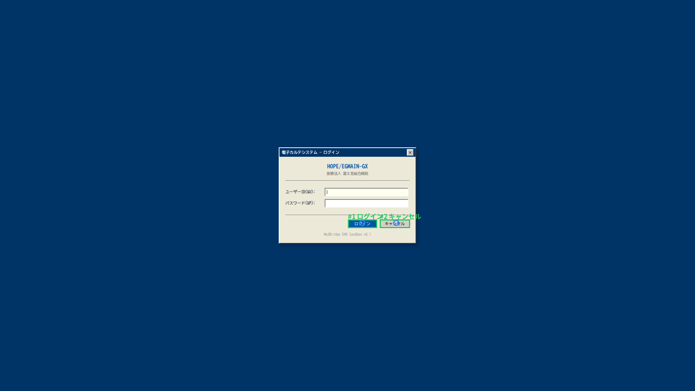
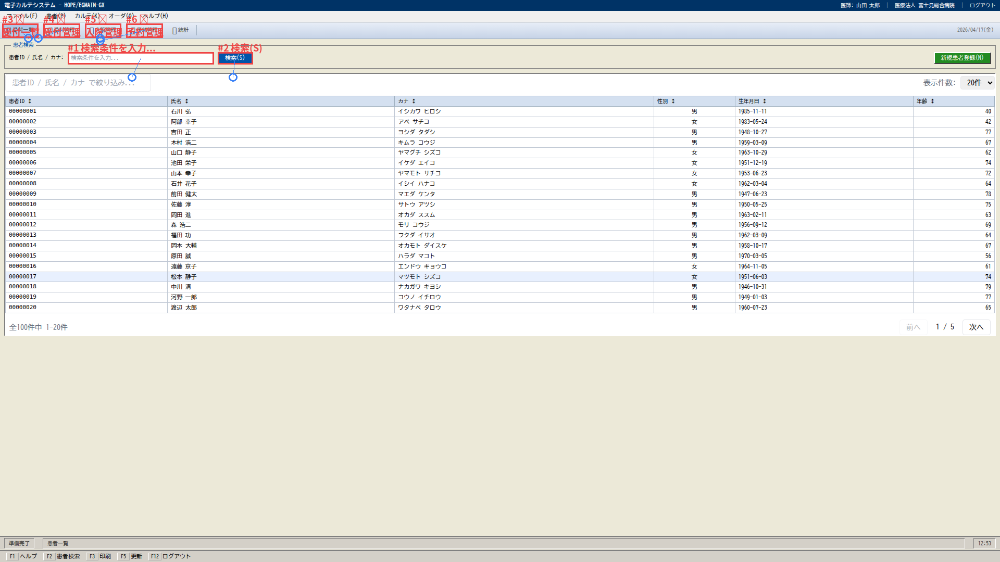
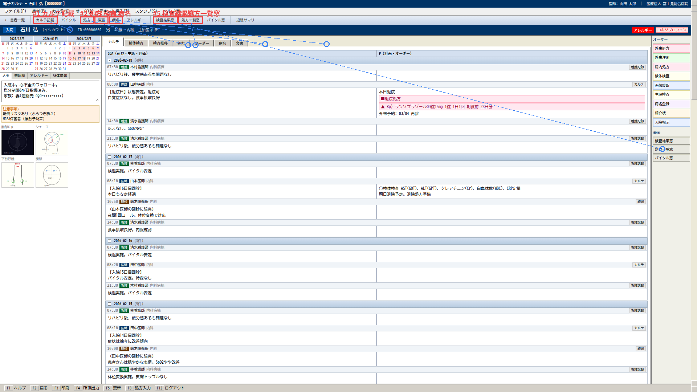
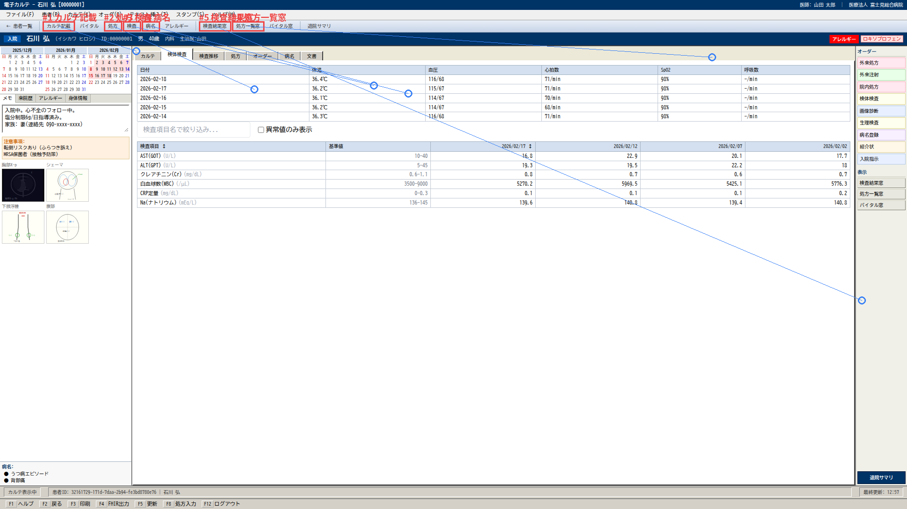
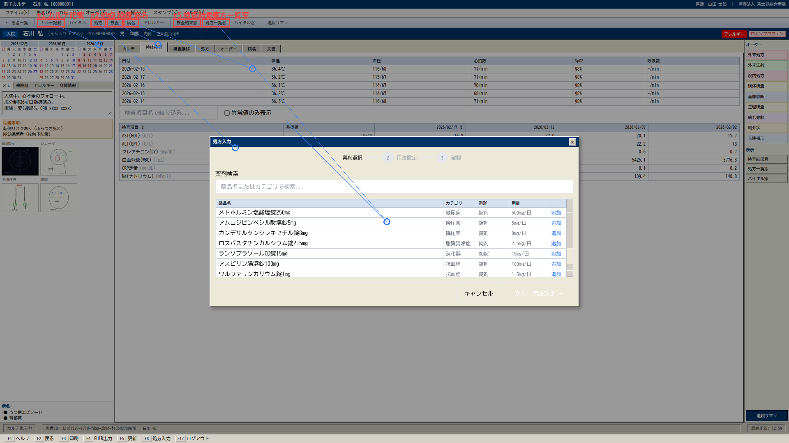
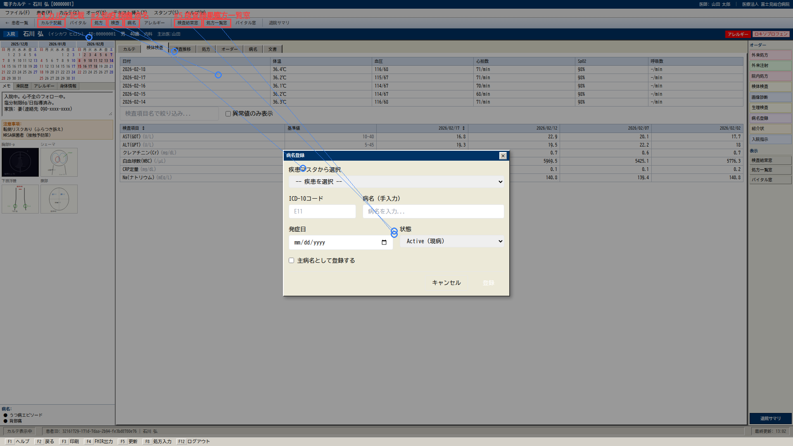

# Holo3 Benchmark Report — 20260423_101721_qwen36-35b-bf16_replay

- Patient: 00000001
- Screens: 6
- Time: 2026-04-23T10:17:21.237264 → 2026-04-23T10:18:44.242665

## Summary

| Metric | Value |
|---|---|
| Grounding hit rate | **0.062** (2/32) |
| Mean pixel distance | **376.1 px** |
| OCR mean recall | **1.000** |

## Per-screen

### login

- Grounding: 2/2

### patient_list

- Grounding: 0/6

### karte

- Grounding: 0/6

### labs

- Grounding: 0/6
- OCR[lab_results]: 6/6 (recall 1.00)

### meds

- Grounding: 0/6
- OCR[medications]: 1/1 (recall 1.00)

### diagnoses

- Grounding: 0/6
- OCR[diagnoses]: 2/2 (recall 1.00)

