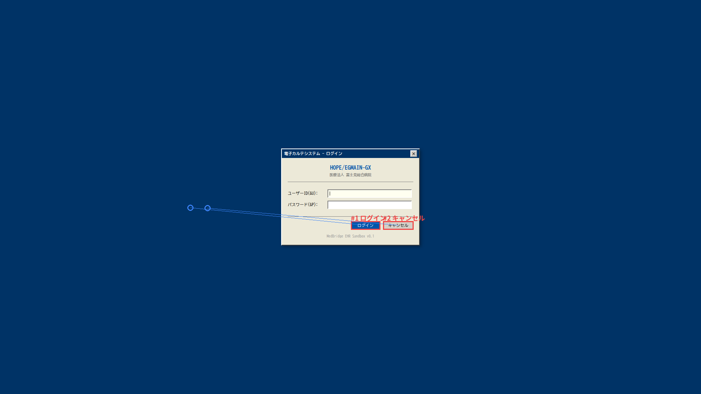
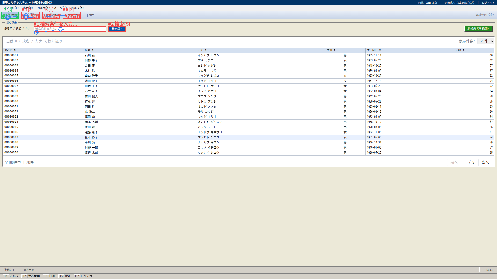
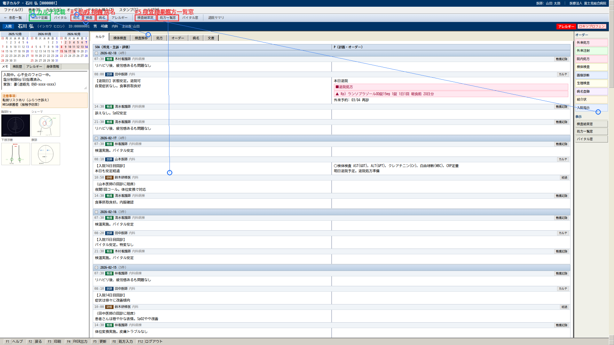
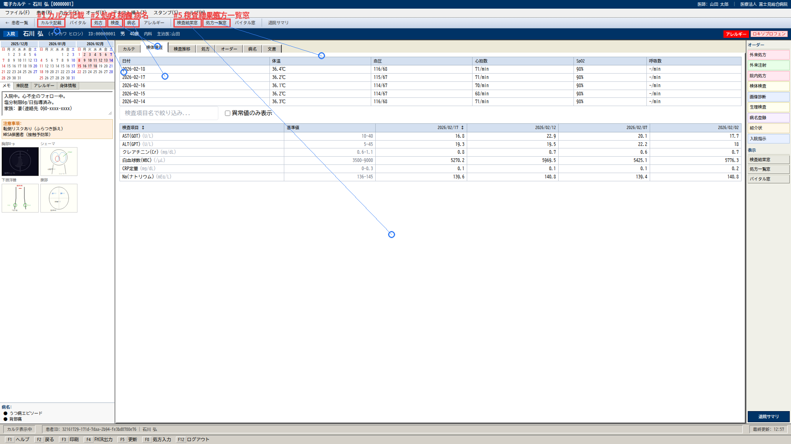
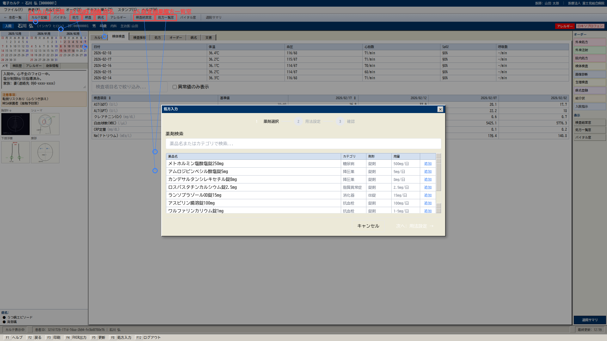
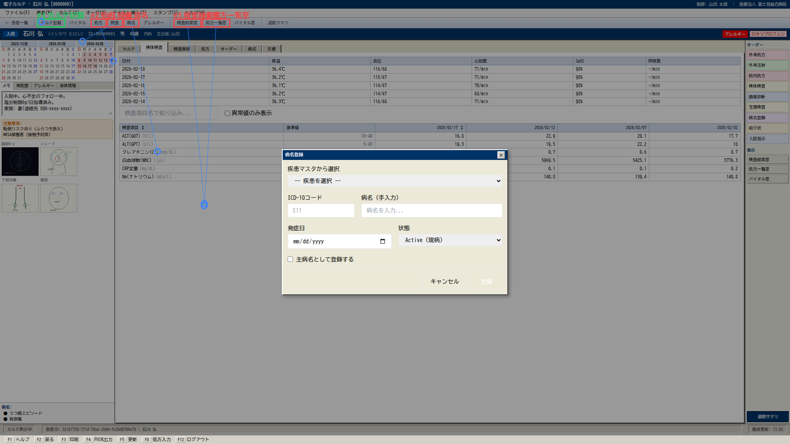

# Holo3 Benchmark Report — 20260423_073917_qwen36_replay

- Patient: 00000001
- Screens: 6
- Time: 2026-04-23T07:39:17.957313 → 2026-04-23T07:39:45.439471

## Summary

| Metric | Value |
|---|---|
| Grounding hit rate | **0.094** (3/32) |
| Mean pixel distance | **247.6 px** |
| OCR mean recall | **1.000** |

## Per-screen

### login

- Grounding: 0/2

### patient_list

- Grounding: 1/6

### karte

- Grounding: 1/6

### labs

- Grounding: 0/6
- OCR[lab_results]: 6/6 (recall 1.00)

### meds

- Grounding: 0/6
- OCR[medications]: 1/1 (recall 1.00)

### diagnoses

- Grounding: 1/6
- OCR[diagnoses]: 2/2 (recall 1.00)

